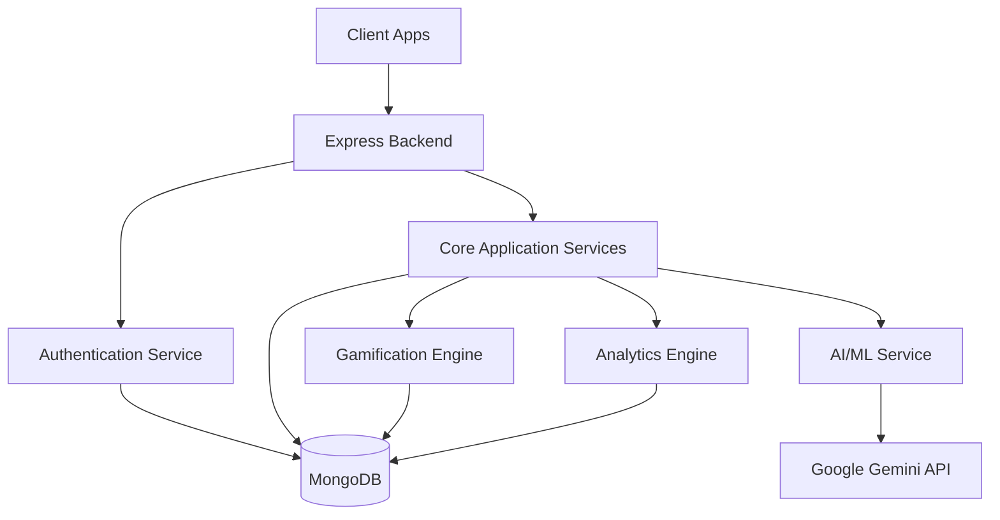

# 🌟 FINMEN — Next-Gen Digital Wellness & Financial Literacy Platform

<div align="center">


[](https://choosealicense.com/licenses/mit/)
[](https://reactjs.org/)
[](https://nodejs.org/)
[](https://www.mongodb.com/)
[](https://ai.google.dev/)

**Empowering India's Youth Through AI-Driven Mental Wellness & Financial Education**

[🚀 Features](#-core-feature-matrix) • [📖 Documentation](#-documentation) • [🤝 Contributing](#-contributing) • [💬 Community](#-community)

</div>

---

## 🎯 Overview

**FINMEN** is a revolutionary digital platform designed specifically for India's youth ecosystem, addressing the critical gap in mental wellness and financial literacy education. Combining cutting-edge AI technology with culturally-sensitive design, FINMEN serves students aged **8-25** through an immersive, gamified learning experience.

### 🌍 Mission Statement
*"To create a generation of emotionally resilient and financially literate individuals who can navigate life's challenges with confidence and wisdom."*

---

## ✨ Key Differentiators

<table>
<tr>
<td width="50%">

### 🇮🇳 **India-Centric Design**
- Regional language support (Hindi, English)
- Cultural context awareness
- Local financial instruments integration
- Indian education system alignment

</td>
<td width="50%">

### 🤖 **AI-Powered Intelligence**
- Advanced CBT therapeutic algorithms
- Personalized learning pathways
- Predictive wellness analytics
- Smart recommendation engine

</td>
</tr>
<tr>
<td width="50%">

### 🎮 **Gamification Excellence**
- Multi-tier progression system
- Social learning features
- Achievement-based rewards
- Peer competition elements

</td>
<td width="50%">

### 🔒 **Privacy-First Approach**
- Zero-knowledge architecture
- GDPR & Indian data laws compliant
- End-to-end encryption
- Transparent data usage

</td>
</tr>
</table>

---

## 🏗️ Advanced Architecture

### 🔧 Technology Stack

<div align="center">

| Layer | Technologies | Purpose |
|-------|-------------|----------|
| **Frontend** |    | Modern, responsive UI with component-based architecture |
| **Backend** |    | RESTful API with real-time communication |
| **Database** |  | NoSQL database for flexible data storage |
| **AI/ML** |    | AI-powered chatbot and analytics |
| **Authentication** |   | Secure user authentication and authorization |

</div>

### 🏛️ System Architecture



---

## 🚀 Core Feature Matrix

### 🧠 **Intelligent Mood Analytics**

<details>
<summary><strong>🎭 Advanced Mood Tracking System</strong></summary>

- **Multi-Modal Input**: Emoji, text, and behavioral pattern analysis
- **Mood Trends**: Track mood patterns over time with visual analytics
- **Cultural Sensitivity**: Indian emotional expression patterns recognition
- **Privacy-First**: Secure storage of sensitive emotional data
- **Integration**: Seamless connection with CBT and wellness modules

</details>

### 🤖 **Cognitive Behavioral Therapy (CBT) Engine**

<details>
<summary><strong>🧘‍♀️ AI-Powered Therapeutic Conversations</strong></summary>

- **Adaptive Protocols**: Dynamic CBT session flows based on user responses
- **Cultural Integration**: Indian mindfulness and wellness practices
- **Crisis Detection**: Real-time risk assessment and emergency protocols
- **Progress Tracking**: Quantified mental wellness metrics
- **Google Gemini Integration**: Advanced AI-powered therapeutic conversations

</details>

### 💰 **Financial Literacy Ecosystem**

<details>
<summary><strong>🎯 Gamified Financial Education</strong></summary>

#### **Learning Modules:**
- **🏫 Junior Track (Ages 8-15)**: Basic money concepts, saving habits, family finances
- **🎓 Pro Track (Ages 16-25)**: Investment strategies, career planning, entrepreneurship

#### **Interactive Features:**
- Budget planning challenges
- Expense tracking tools
- Savings goal setting
- Investment simulations
- Financial quizzes

</details>

### 🏆 **Advanced Gamification System**

<details>
<summary><strong>🎮 Multi-Layered Engagement Framework</strong></summary>

#### **Reward Economy:**
- Daily wellness check-ins
- CBT session completion
- Financial quiz mastery
- Community contributions
- Streak maintenance

#### **Achievement System:**
- Bronze, Silver, Gold tier achievements
- Leaderboards and rankings
- Redemption marketplace
- Digital badges and certificates

</details>

---

## 📊 Advanced Dashboard Ecosystem

### 👨‍🎓 **Student Dashboard**
- **Wellness Metrics**: Mood trends, CBT progress, stress indicators
- **Financial Profile**: Learning progress, investment simulations, goal tracking
- **Social Features**: Peer rankings, leaderboards, achievements
- **Personalization**: AI-driven content recommendations and learning paths

### 👨‍🏫 **Educator Portal**
- **Class Analytics**: Aggregated wellness and learning insights
- **Student Management**: Student progress monitoring and support
- **Resource Library**: Educational materials and curriculum tools
- **Redemption Management**: Approve and manage student reward redemptions

### 👨‍💼 **Administrator Console**
- **Platform Analytics**: User engagement, feature utilization, system health
- **User Management**: Advanced user lifecycle and support features
- **Educator Approval**: Manage educator registration and verification
- **System Settings**: Platform configuration and customization

---

## 🛠️ Development Ecosystem

### 📋 **Prerequisites**

```bash
# System Requirements
Node.js >= 18.0.0
MongoDB >= 5.0
Python >= 3.9
```

### 🚀 **Quick Start Guide**

<details>
<summary><strong>⚡ Development Setup</strong></summary>

#### **Backend Configuration**
```bash
cd backend
npm install

# Configure environment variables
cp .env.example .env
# Edit .env with your configuration

# Start development server
npm run dev
```

#### **Frontend Configuration**
```bash
cd frontend
npm install

# Configure environment variables
cp .env.example .env
# Edit .env with your configuration

# Start development server
npm run dev
```

#### **AI/ML Service Configuration**
```bash
cd AIML
pip install -r requirements.txt

# Configure environment variables
cp .env.example .env
# Edit .env with your configuration

# Start development server
python app.py
```

</details>

### 🔐 **Environment Configuration**

<details>
<summary><strong>📝 Backend Environment Variables</strong></summary>

```env
# Server Configuration
NODE_ENV=development
PORT=5000

# Database Configuration
MONGO_URI=mongodb://localhost:27017/finmen

# Authentication
JWT_SECRET=your_ultra_secure_jwt_secret
JWT_EXPIRE=30d

# OAuth Configuration
GOOGLE_CLIENT_ID=your_google_client_id
GOOGLE_CLIENT_SECRET=your_google_client_secret
GOOGLE_CALLBACK_URL=http://localhost:5000/api/auth/google/callback

# Email Services
SMTP_HOST=smtp.gmail.com
SMTP_PORT=587
SMTP_USER=your_email@gmail.com
SMTP_PASS=your_app_password

# CORS Configuration
CLIENT_URL=http://localhost:3000,http://localhost:5173
```

</details>

<details>
<summary><strong>🎨 Frontend Environment Variables</strong></summary>

```env
# API Configuration
VITE_API_BASE_URL=http://localhost:5000/api

# Authentication
VITE_GOOGLE_CLIENT_ID=your_google_client_id

# Features Flags
VITE_ENABLE_CBT_CHATBOT=true
VITE_ENABLE_DARK_MODE=true
```

</details>

<details>
<summary><strong>🤖 AI/ML Environment Variables</strong></summary>

```env
# Google Gemini API
GEMINI_API_KEY=your_gemini_api_key

# Flask Configuration
FLASK_ENV=development
PORT=5000
```

</details>

---

## 📁 Project Structure

<details>
<summary><strong>🗂️ Directory Architecture</strong></summary>

```
finmen/
├── backend/                      # Node.js Express Backend
│   ├── config/                   # Configuration files
│   ├── controllers/              # Route controllers
│   ├── middlewares/              # Express middlewares
│   ├── models/                   # MongoDB models
│   ├── routes/                   # API routes
│   ├── services/                 # Business logic services
│   ├── socketHandlers/           # Socket.IO handlers
│   ├── utils/                    # Utility functions
│   ├── server.js                 # Main server file
│   └── package.json              # Backend dependencies
│
├── frontend/                     # React Vite Frontend
│   ├── public/                   # Static assets
│   ├── src/                      # Source code
│   │   ├── assets/               # Images, fonts, etc.
│   │   ├── components/           # Reusable UI components
│   │   ├── context/              # React context providers
│   │   ├── data/                 # Static data files
│   │   ├── hooks/                # Custom React hooks
│   │   ├── pages/                # Page components
│   │   │   ├── Admin/            # Admin pages
│   │   │   ├── Auth/             # Authentication pages
│   │   │   ├── Educator/         # Educator pages
│   │   │   ├── Games/            # Game components
│   │   │   └── Student/          # Student pages
│   │   ├── services/             # API service layers
│   │   └── utils/                # Utility functions
│   ├── index.html                # HTML entry point
│   └── package.json              # Frontend dependencies
│
└── AIML/                         # Python AI/ML Service
    ├── datasets/                 # Training datasets
    ├── app.py                    # Flask API server
    ├── Gemini.py                 # Google Gemini integration
    ├── finance_calculator.py     # Financial calculations
    ├── math_solver.py            # Math problem solver
    └── requirements.txt          # Python dependencies
```

</details>

---

## 🔒 Security & Compliance

### 🛡️ **Security Measures**

<div align="center">

| Security Layer | Implementation | Standards |
|----------------|----------------|----------|
| **Authentication** | JWT + Google OAuth 2.0 | OWASP Compliance |
| **Data Protection** | Secure password hashing, Data validation | Industry Standard |
| **API Security** | Rate limiting, CORS, Input validation | OWASP Top 10 |
| **Privacy** | Data minimization, User consent | GDPR & IT Act 2000 |

</div>

---

## 🤝 Contributing

### 👥 **Our Development Team**

<div align="center">

<table>
<tr>
<td align="center">
<br />
<sub><b>Vikash Kumar</b></sub><br />
<sub>Backend Architect</sub>
</td>
<td align="center">
<br />
<sub><b>Tilak Devi</b></sub><br />
<sub>Backend Developer</sub>
</td>
<td align="center">
<br />
<sub><b>Shobhit Dwivedi</b></sub><br />
<sub>Frontend Developer</sub>
</td>
</tr>
</table>

</div>

### 🛠️ **Contribution Guidelines**

<details>
<summary><strong>🔄 Development Workflow</strong></summary>

1. **🍴 Fork & Clone**
   ```bash
   git clone https://github.com/your-username/finmen.git
   cd finmen
   ```

2. **🌿 Create Feature Branch**
   ```bash
   git checkout -b feature/amazing-new-feature
   ```

3. **💻 Development Standards**
   - Follow ESLint and Prettier configurations
   - Write comprehensive tests
   - Update documentation for new features
   - Follow conventional commit messages

4. **📝 Pull Request Process**
   - Ensure all tests pass
   - Request review from team members
   - Address all feedback promptly

</details>

### 🏷️ **Code Standards**

- **JavaScript**: ESLint + Prettier
- **React**: Functional components + Hooks
- **CSS**: Tailwind CSS
- **Documentation**: JSDoc + Markdown

---

## 📄 License & Legal

### 📜 **Open Source License**

```
MIT License

Copyright (c) 2024 FINMEN Platform Team

Permission is hereby granted, free of charge, to any person obtaining a copy
of this software and associated documentation files (the "Software"), to deal
in the Software without restriction, including without limitation the rights
to use, copy, modify, merge, publish, distribute, sublicense, and/or sell
copies of the Software, and to permit persons to whom the Software is
furnished to do so, subject to the following conditions:

The above copyright notice and this permission notice shall be included in all
copies or substantial portions of the Software.

THE SOFTWARE IS PROVIDED "AS IS", WITHOUT WARRANTY OF ANY KIND, EXPRESS OR
IMPLIED, INCLUDING BUT NOT LIMITED TO THE WARRANTIES OF MERCHANTABILITY,
FITNESS FOR A PARTICULAR PURPOSE AND NONINFRINGEMENT.
```

---

<div align="center">

**Made with ❤️ for India's Digital Future**

*Building bridges between mental wellness and financial prosperity, one student at a time.*

</div>
