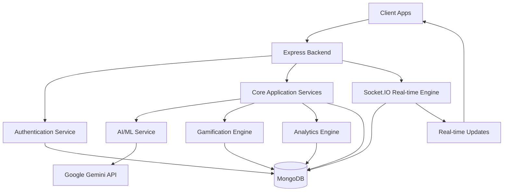

# 🌟 Wise Student — Next-Gen Digital Wellness & Financial Literacy Platform

<div align="center">


[](https://choosealicense.com/licenses/mit/)
[](https://reactjs.org/)
[](https://nodejs.org/)
[](https://www.mongodb.com/)
[](https://socket.io/)
[](https://ai.google.dev/)

**Empowering India's Youth Through AI-Driven Mental Wellness & Financial Education**

[🚀 Features](#-core-features) • [📖 Documentation](#-documentation) • [🤝 Contributing](#-contributing) • [💬 Community](#-community)

</div>

---

## 🎯 Overview

**Wise Student** is a comprehensive digital platform designed specifically for India's youth ecosystem, addressing critical gaps in mental wellness and financial literacy education. Combining cutting-edge AI technology with real-time communication and culturally-sensitive design, Wise Student serves students aged **8-25** through an immersive, gamified learning experience.

### 🌍 Mission Statement
*"To create a generation of emotionally resilient and financially literate individuals who can navigate life's challenges with confidence and wisdom."*

---

## ✨ Key Differentiators

<table>
<tr>
<td width="50%">

### 🇮🇳 **India-Centric Design**
- Regional language support (Hindi, English)
- Cultural context awareness
- Local financial instruments integration
- Indian education system alignment
- Multi-tenant architecture for schools & colleges

</td>
<td width="50%">

### 🤖 **AI-Powered Intelligence**
- Advanced CBT therapeutic algorithms
- Personalized learning pathways
- Predictive wellness analytics
- Smart recommendation engine
- Google Gemini integration

</td>
</tr>
<tr>
<td width="50%">

### 🎮 **Advanced Gamification**
- 1000+ unique daily challenges
- Real-time leaderboards
- XP and HealCoins reward system
- Multi-tier progression system
- Social learning features

</td>
<td width="50%">

### ⚡ **Real-Time Features**
- Live profile updates
- Instant reward notifications
- Real-time leaderboard updates
- Socket.IO powered communication
- Live chat and CBT sessions

</td>
</tr>
</table>

---

## 🏗️ Advanced Architecture

### 🔧 Technology Stack

<div align="center">

| Layer | Technologies | Purpose |
|-------|-------------|----------|
| **Frontend** |       | Modern, responsive UI with component-based architecture |
| **Backend** |     | RESTful API with real-time communication |
| **Database** |  | NoSQL database for flexible data storage |
| **AI/ML** |     | AI-powered chatbot, math solver, and financial calculator |
| **Authentication** |    | Secure user authentication and authorization |
| **Payment** |   | Payment gateway integration for subscriptions and transactions |
| **Storage** |  | Cloud-based media storage and management |
| **Email** |   | Email service for notifications and communications |

</div>

### 🏛️ System Architecture



---

## 🚀 Core Features

### 🧠 **Intelligent Mood Analytics**

<details>
<summary><strong>🎭 Advanced Mood Tracking System</strong></summary>

- **Multi-Modal Input**: Emoji, text, and behavioral pattern analysis
- **Mood Trends**: Track mood patterns over time with visual analytics
- **Cultural Sensitivity**: Indian emotional expression patterns recognition
- **Privacy-First**: Secure storage of sensitive emotional data
- **Integration**: Seamless connection with CBT and wellness modules
- **Real-time Updates**: Live mood tracking and trend analysis

</details>

### 🤖 **Cognitive Behavioral Therapy (CBT) Engine**

<details>
<summary><strong>🧘‍♀️ AI-Powered Therapeutic Conversations</strong></summary>

- **Adaptive Protocols**: Dynamic CBT session flows based on user responses
- **Cultural Integration**: Indian mindfulness and wellness practices
- **Crisis Detection**: Real-time risk assessment and emergency protocols
- **Progress Tracking**: Quantified mental wellness metrics
- **Google Gemini Integration**: Advanced AI-powered therapeutic conversations
- **Real-time Chat**: Live CBT sessions with instant responses

</details>

### 💰 **Financial Literacy Ecosystem**

<details>
<summary><strong>🎯 Gamified Financial Education</strong></summary>

#### **Learning Modules:**
- **🏫 Junior Track (Ages 8-15)**: Basic money concepts, saving habits, family finances
- **🎓 Pro Track (Ages 16-25)**: Investment strategies, career planning, entrepreneurship

#### **Interactive Features:**
- Budget planning challenges
- Expense tracking tools
- Savings goal setting
- Investment simulations
- Financial quizzes
- Real-time progress tracking
- Budget transaction management
- Financial mission tracking
- Expense categorization
- Financial calculator integration

</details>

### 🎓 **Career & Placement Services**

<details>
<summary><strong>💼 Comprehensive Career Development Platform</strong></summary>

- **Job Portal**: Browse and apply for job openings
- **Application Tracking**: Track job application status
- **Company Profiles**: Explore company information
- **Placement Officer Dashboard**: Manage placements and career guidance
- **Alumni Network**: Connect with alumni for mentorship
- **Career Planning**: Career path guidance and planning tools

</details>

### 🏫 **School & College Management**

<details>
<summary><strong>📚 Multi-Tenant Educational Institution Platform</strong></summary>

- **School Management**: Complete school administration system
- **College Management**: College-specific features and workflows
- **Class Management**: Class creation and student assignment
- **Timetable Management**: Schedule and timetable creation
- **Fee Management**: Fee structure and payment tracking
- **Transport Management**: School transport and route management
- **Hostel Management**: Hostel allocation and management
- **Assignment System**: Create, distribute, and track assignments
- **Teacher Access Control**: Role-based access for educators

</details>

### 📊 **Advanced Analytics & Reporting**

<details>
<summary><strong>📈 Comprehensive Analytics Suite</strong></summary>

- **User Analytics**: Detailed user behavior and engagement metrics
- **Game Analytics**: Game performance and completion statistics
- **Financial Analytics**: Revenue and transaction analytics
- **CSR Impact Analytics**: CSR campaign impact measurement
- **Predictive Models**: AI-powered predictive analytics
- **Behavior Analytics**: User behavior pattern analysis
- **Smart Insights**: Automated insights and recommendations
- **Custom Reports**: Generate PDF and Excel reports
- **Real-time Dashboards**: Live analytics dashboards

</details>

### 💬 **Communication & Collaboration**

<details>
<summary><strong>📢 Multi-Channel Communication System</strong></summary>

- **Real-time Chat**: Socket.IO powered instant messaging
- **CBT Chat Sessions**: AI-powered therapeutic conversations
- **Announcements**: Platform-wide and targeted announcements
- **Communication Templates**: Pre-built message templates
- **Email Notifications**: Automated email notifications
- **Push Notifications**: Real-time push notifications
- **Presentation Builder**: Collaborative presentation creation
- **Feedback System**: User feedback collection and management

</details>

### 🏆 **Advanced Gamification System**

<details>
<summary><strong>🎮 Multi-Layered Engagement Framework</strong></summary>

#### **1000+ Daily Challenges:**
- **Unique Challenge Pool**: 1000 distinct challenges covering all aspects
- **Daily Selection**: 10 different challenges shown each day
- **No Repetition**: Challenges don't repeat until all 1000 are completed
- **Auto-Reset**: Cycle restarts after completing all challenges

#### **Reward Economy:**
- **HealCoins**: Virtual currency earned through activities
- **XP System**: Experience points for level progression
- **Real-time Rewards**: Instant coin and XP updates
- **Streak Maintenance**: Daily engagement rewards
- **Achievement System**: Bronze, Silver, Gold tier achievements

#### **Social Features:**
- **Live Leaderboards**: Real-time XP-based rankings
- **Peer Competition**: Compare progress with friends
- **Redemption Marketplace**: Exchange coins for rewards
- **Digital Badges**: Recognition for accomplishments

</details>

### ⚡ **Real-Time Communication System**

<details>
<summary><strong>🔄 Live Updates & Notifications</strong></summary>

#### **Socket.IO Integration:**
- **Profile Updates**: Real-time profile changes across all dashboards
- **Game Completion**: Instant reward notifications
- **Challenge Progress**: Live challenge completion updates
- **Leaderboard Updates**: Real-time ranking changes
- **Chat System**: Live messaging and CBT conversations
- **Wallet Updates**: Instant balance and transaction updates

#### **Real-time Features:**
- **Live Notifications**: Toast notifications for all activities
- **Auto-refresh**: Data updates without page reload
- **Multi-user Sync**: Changes visible to all relevant users
- **Connection Management**: Automatic reconnection on network issues

</details>

---

## 📊 Advanced Dashboard Ecosystem

### 👨‍🎓 **Student Dashboard**
- **Wellness Metrics**: Mood trends, CBT progress, stress indicators
- **Financial Profile**: Learning progress, investment simulations, goal tracking
- **Social Features**: Peer rankings, leaderboards, achievements
- **Personalization**: AI-driven content recommendations and learning paths
- **Real-time Updates**: Live notifications and progress tracking
- **Profile Management**: Comprehensive profile editing with avatar upload
- **1000+ Educational Games**: Access to all game categories
- **Journal System**: Personal journaling and reflection
- **Assignment Tracking**: View and submit assignments
- **Career Portal**: Job openings and application tracking
- **Subscription Management**: Manage premium subscriptions
- **Wallet & Rewards**: Track coins, XP, and redeem rewards

### 👨‍🏫 **Educator Portal**
- **Class Analytics**: Aggregated wellness and learning insights
- **Student Management**: Student progress monitoring and support
- **Resource Library**: Educational materials and curriculum tools
- **Redemption Management**: Approve and manage student reward redemptions
- **Real-time Monitoring**: Live student activity tracking
- **Communication Center**: Direct messaging with students
- **Assignment Management**: Create and track assignments
- **Presentation Builder**: Create interactive presentations
- **School Management**: Class and timetable management

### 👨‍💼 **Administrator Console**
- **Platform Analytics**: User engagement, feature utilization, system health
- **User Management**: Advanced user lifecycle and support features
- **Educator Approval**: Manage educator registration and verification
- **System Settings**: Platform configuration and customization
- **Real-time Monitoring**: Live system health and user activity
- **Multi-tenant Management**: Organization and role management
- **Behavior Analytics**: User behavior tracking and insights
- **Financial Console**: Revenue tracking and financial management
- **Support Desk**: Customer support ticket management
- **API Control Plane**: API key management and monitoring
- **Content Governance**: Content moderation and compliance
- **Incident Management**: Security and privacy incident tracking
- **Predictive Models**: AI-powered predictive analytics
- **Smart Insights**: Automated insights and recommendations

### 👨‍👩‍👧‍👦 **Parent Dashboard**
- **Child Progress**: Digital twin tracking across all pillars
- **Reward Monitoring**: Track coin usage and redemptions
- **Subscription Management**: Plan upgrades and billing
- **Real-time Updates**: Live notifications of child activities

### 🏪 **Seller Dashboard**
- **Product Management**: Add/edit/delete items with pricing
- **Voucher Redemption**: QR code validation and approval
- **Sales Analytics**: Revenue tracking and commission management
- **Real-time Updates**: Live sales and redemption notifications

### 🏢 **CSR/Sponsor Dashboard**
- **Impact Metrics**: Students benefitted and value funded
- **Regional Analysis**: Geographic impact distribution
- **Report Generation**: Automated PDF/Excel reports
- **Real-time Tracking**: Live impact measurement
- **Campaign Management**: Create and manage CSR campaigns
- **Budget Tracking**: Financial tracking and budget management
- **KPI Dashboard**: Key performance indicators and metrics
- **Cobranding**: Custom branding and legal compliance
- **Campaign Wizard**: Step-by-step campaign creation
- **Approval Workflow**: Campaign approval and management

---

## 🎮 Comprehensive Game Ecosystem

### **Game Categories (1000+ Games)**

The platform features an extensive collection of educational games organized into multiple categories, each with age-appropriate content for **Kids (8-15)** and **Teens (16-25)**:

#### **1. DCOS (Digital Citizenship & Online Safety)**
- **Privacy & Security**: Password sharing, privacy settings, OTP fraud prevention
- **Cyberbullying & Respect**: Anti-bullying reflexes, empathy building, upstander simulation
- **AI & Future Tech**: AI jobs debate, deepfake detection, digital reputation
- **Career Planning**: College applications, entrepreneurship, career puzzles
- **Digital Wellness**: Screen time management, digital detox, sleep hygiene

#### **2. Brain (Cognitive Development)**
- Problem-solving challenges
- Critical thinking exercises
- Memory and concentration games
- Logic puzzles and brain teasers

#### **3. Finance (Financial Literacy)**
- Budget planning and expense tracking
- Savings goals and investment simulations
- Financial quizzes and calculators
- Real-world financial scenarios

#### **4. Health (Physical & Mental Wellness)**
- **Health (Male)**: Male-specific health education and wellness
- **Health (Female)**: Female-specific health education and wellness
- Mindfulness and breathing exercises
- Stress management techniques
- Healthy lifestyle habits

#### **5. Moral Values**
- Ethical decision-making scenarios
- Character building activities
- Values-based learning games
- Social responsibility exercises

#### **6. CRGC (Career Readiness & Growth)**
- Career exploration games
- Skill development challenges
- Professional growth simulations
- Industry-specific learning

#### **7. EHE (Environmental Health & Education)**
- Environmental awareness games
- Sustainability challenges
- Climate action simulations
- Eco-friendly practices

#### **8. UVLS (Universal Values & Life Skills)**
- Life skills development
- Universal values education
- Practical life scenarios
- Personal development games

#### **9. AiForAll (AI Literacy)**
- AI concepts and applications
- Machine learning basics
- AI ethics and responsible use
- Future of technology

#### **10. Sustainability**
- Carbon and climate awareness
- Solar and city planning
- Waste and recycling
- Water and energy conservation

### **Game Features:**
- **1000+ Unique Games**: Comprehensive library covering all learning domains
- **Age-Appropriate Content**: Separate modules for Kids and Teens
- **Real-time Scoring**: Live XP and coin updates via Socket.IO
- **Progress Tracking**: Detailed completion analytics and achievements
- **Achievement System**: Unlockable rewards, badges, and certificates
- **Social Integration**: Share achievements and compete on leaderboards
- **Gamified Learning**: Interactive stories, quizzes, puzzles, simulations, and role-plays

---

## 🛠️ Development Ecosystem

### 📋 **Prerequisites**

```bash
# System Requirements
Node.js >= 18.0.0
MongoDB >= 5.0
Python >= 3.9
```

### 🚀 **Quick Start Guide**

<details>
<summary><strong>⚡ Development Setup</strong></summary>

#### **Backend Configuration**
```bash
cd backend
npm install

# Configure environment variables
cp .env.example .env
# Edit .env with your configuration

# Start development server
npm run dev
```

#### **Frontend Configuration**
```bash
cd frontend
npm install

# Configure environment variables
cp .env.example .env
# Edit .env with your configuration

# Start development server
npm run dev
```

#### **AI/ML Service Configuration**
```bash
cd AIML
pip install -r requirements.txt

# Configure environment variables
cp .env.example .env
# Edit .env with your configuration

# Start development server
python app.py
```

</details>

### 🔐 **Environment Configuration**

<details>
<summary><strong>📝 Backend Environment Variables</strong></summary>

```env
# Server Configuration
NODE_ENV=development
PORT=5000

# Database Configuration
MONGO_URI=mongodb://localhost:27017/wise-student

# Authentication
JWT_SECRET=your_ultra_secure_jwt_secret
JWT_EXPIRE=30d

# OAuth Configuration
GOOGLE_CLIENT_ID=your_google_client_id
GOOGLE_CLIENT_SECRET=your_google_client_secret
GOOGLE_CALLBACK_URL=http://localhost:5000/api/auth/google/callback

# Email Services (Resend API)
RESEND_API_KEY=re_your_resend_api_key_here
RESEND_FROM_EMAIL=noreply@yourdomain.com

# Payment Gateways
RAZORPAY_KEY_ID=your_razorpay_key_id
RAZORPAY_KEY_SECRET=your_razorpay_key_secret
STRIPE_SECRET_KEY=your_stripe_secret_key
STRIPE_PUBLISHABLE_KEY=your_stripe_publishable_key

# Cloudinary (Media Storage)
CLOUDINARY_CLOUD_NAME=your_cloud_name
CLOUDINARY_API_KEY=your_api_key
CLOUDINARY_API_SECRET=your_api_secret

# AI/ML Service
AIML_SERVICE_URL=http://localhost:5001

# CORS Configuration
CLIENT_URL=http://localhost:3000,http://localhost:5173

# Socket.IO Configuration
SOCKET_CORS_ORIGIN=http://localhost:3000,http://localhost:5173
```

</details>

<details>
<summary><strong>🎨 Frontend Environment Variables</strong></summary>

```env
# API Configuration
VITE_API_URL=http://localhost:5000
VITE_API_BASE_URL=http://localhost:5000/api

# Authentication
VITE_GOOGLE_CLIENT_ID=your_google_client_id

# Features Flags
VITE_ENABLE_CBT_CHATBOT=true
VITE_ENABLE_DARK_MODE=true
VITE_ENABLE_REAL_TIME=true
```

</details>

<details>
<summary><strong>🤖 AI/ML Environment Variables</strong></summary>

```env
# Google Gemini API
GEMINI_API_KEY=your_gemini_api_key

# Flask Configuration
FLASK_ENV=development
PORT=5001
```

</details>

---

## 📁 Project Structure

<details>
<summary><strong>🗂️ Directory Architecture</strong></summary>

```
wise-student/
├── backend/                      # Node.js Express Backend
│   ├── config/                   # Configuration files
│   │   ├── db.js                 # Database configuration
│   │   └── passport.js           # Authentication strategies
│   ├── controllers/              # Route controllers (70+ controllers)
│   │   ├── authController.js     # Authentication logic
│   │   ├── userController.js     # User management
│   │   ├── gameController.js     # Game logic
│   │   ├── cbtController.js      # CBT chat system
│   │   ├── moodController.js     # Mood tracking
│   │   ├── walletController.js   # Wallet management
│   │   ├── adminController.js    # Admin operations
│   │   ├── studentController.js  # Student management
│   │   ├── schoolController.js   # School management
│   │   ├── csrKPIController.js   # CSR analytics
│   │   ├── campaignController.js # Campaign management
│   │   ├── paymentController.js  # Payment processing
│   │   ├── redemptionController.js # Reward redemption
│   │   ├── marketplaceController.js # Marketplace operations
│   │   ├── jobOpeningController.js # Job postings
│   │   ├── presentationController.js # Presentation builder
│   │   └── ...                   # 50+ additional controllers
│   ├── middlewares/              # Express middlewares
│   │   ├── authMiddleware.js     # Authentication middleware
│   │   ├── requireAuth.js        # Auth requirement
│   │   ├── checkRole.js          # Role-based access
│   │   └── errorMiddleware.js    # Error handling
│   ├── models/                   # MongoDB models (107+ models)
│   │   ├── User.js               # User schema
│   │   ├── Wallet.js             # Wallet schema
│   │   ├── Game.js               # Game schema
│   │   ├── CBTSession.js         # CBT sessions
│   │   ├── MoodLog.js            # Mood tracking
│   │   ├── Organization.js       # Multi-tenant organizations
│   │   ├── School/               # School-specific models
│   │   ├── Campaign.js           # CSR campaigns
│   │   ├── PaymentTransaction.js # Payment records
│   │   ├── JobOpening.js         # Job postings
│   │   ├── Presentation.js       # Presentation templates
│   │   ├── Subscription.js       # User subscriptions
│   │   ├── AnalyticsEvent.js     # Analytics tracking
│   │   └── ...                   # 90+ additional models
│   ├── routes/                   # API routes (71+ route files)
│   │   ├── authRoutes.js         # Authentication routes
│   │   ├── userRoutes.js         # User routes
│   │   ├── gameRoutes.js         # Game routes
│   │   ├── studentRoutes.js      # Student routes
│   │   ├── adminRoutes.js        # Admin routes
│   │   ├── schoolRoutes.js       # School routes
│   │   ├── csrRoutes.js          # CSR routes
│   │   ├── paymentRoutes.js      # Payment routes
│   │   ├── walletRoutes.js       # Wallet routes
│   │   ├── careerRoutes.js       # Career/job routes
│   │   └── ...                   # 60+ additional routes
│   ├── socketHandlers/           # Socket.IO handlers
│   │   ├── chatSocket.js         # Chat functionality
│   │   ├── gameSocket.js         # Game updates
│   │   ├── walletSocket.js       # Wallet updates
│   │   ├── journalSocket.js      # Journal updates
│   │   ├── presentationSocket.js # Presentation collaboration
│   │   ├── csrOverviewSocket.js  # CSR real-time updates
│   │   └── feedbackSocket.js     # Feedback system
│   ├── services/                 # Business logic services (25+ services)
│   │   ├── emailService.js       # Email functionality
│   │   ├── otpService.js         # OTP generation
│   │   ├── aimlService.js        # AI/ML integration
│   │   ├── notificationService.js # Push notifications
│   │   ├── pdfReportGenerator.js # PDF report generation
│   │   ├── smartInsightsService.js # AI insights
│   │   ├── predictiveModelsService.js # Predictive analytics
│   │   ├── behaviorAnalyticsService.js # Behavior tracking
│   │   ├── communicationService.js # Communication suite
│   │   └── ...                   # 15+ additional services
│   ├── utils/                    # Utility functions
│   │   ├── generateToken.js      # JWT generation
│   │   ├── cbtBotEngine.js       # CBT AI logic
│   │   └── ...                   # Other utilities
│   ├── server.js                 # Main server file
│   └── package.json              # Backend dependencies
│
├── frontend/                     # React Vite Frontend
│   ├── public/                   # Static assets
│   │   └── avatars/              # Default avatar images
│   ├── src/                      # Source code
│   │   ├── assets/               # Images, fonts, etc.
│   │   ├── components/           # Reusable UI components
│   │   │   ├── Profile.jsx       # User profile component
│   │   │   ├── Navbar.jsx        # Navigation component
│   │   │   ├── Chatbot.jsx       # CBT chat interface
│   │   │   └── ...               # Other components
│   │   ├── context/              # React context providers
│   │   │   ├── AuthContext.jsx   # Authentication context
│   │   │   ├── SocketContext.jsx # Socket.IO context
│   │   │   ├── WalletContext.jsx # Wallet context
│   │   │   └── NotificationContext.jsx # Notifications
│   │   ├── data/                 # Static data files
│   │   │   ├── mockFeatures.js   # Feature data
│   │   │   └── mockAchievements.js # Achievement data
│   │   ├── hooks/                # Custom React hooks
│   │   │   ├── useAuth.js        # Authentication hook
│   │   │   ├── useSocket.js      # Socket hook
│   │   │   └── useNotification.js # Notification hook
│   │   ├── pages/                # Page components (2400+ files)
│   │   │   ├── Admin/            # Admin pages (30+ pages)
│   │   │   │   ├── AdminDashboard.jsx
│   │   │   │   ├── AllStudents.jsx
│   │   │   │   ├── AdminAnalytics.jsx
│   │   │   │   ├── AdminPlatform.jsx
│   │   │   │   ├── BehaviorAnalytics.jsx
│   │   │   │   ├── FinancialConsole.jsx
│   │   │   │   ├── SupportDesk.jsx
│   │   │   │   └── ...           # 20+ additional admin pages
│   │   │   ├── Auth/             # Authentication pages
│   │   │   │   ├── Login.jsx
│   │   │   │   ├── Register.jsx
│   │   │   │   ├── GoogleLogin.jsx
│   │   │   │   ├── ParentRegister.jsx
│   │   │   │   ├── TeacherRegister.jsx
│   │   │   │   └── ...           # Other auth pages
│   │   │   ├── Student/          # Student pages (2000+ game files)
│   │   │   │   ├── StudentDashboard.jsx
│   │   │   │   ├── Leaderboard.jsx
│   │   │   │   ├── WalletPage.jsx
│   │   │   │   ├── MoodTracker.jsx
│   │   │   │   ├── Journal.jsx
│   │   │   │   ├── DCOS/         # 100+ DCOS games
│   │   │   │   ├── Brain/        # 100+ Brain games
│   │   │   │   ├── Finance/      # 100+ Finance games
│   │   │   │   ├── HealthMale/   # 100+ Health games
│   │   │   │   ├── HealthFemale/ # 100+ Health games
│   │   │   │   ├── MoralValues/  # 100+ Moral games
│   │   │   │   ├── CRGC/         # 100+ Career games
│   │   │   │   ├── EHE/          # 100+ Environment games
│   │   │   │   ├── UVLS/         # 100+ Life skills games
│   │   │   │   ├── AiForAll/     # 100+ AI games
│   │   │   │   └── Sustainability/ # Sustainability games
│   │   │   ├── School/           # School pages (35+ pages)
│   │   │   │   └── ...           # School management pages
│   │   │   ├── College/          # College-specific pages
│   │   │   │   ├── AlumniNetwork.jsx
│   │   │   │   ├── PlacementOfficerDashboard.jsx
│   │   │   │   └── ...           # College management pages
│   │   │   ├── CSR/              # CSR dashboard pages
│   │   │   │   ├── CSRDashboard.jsx
│   │   │   │   ├── CSRCampaigns.jsx
│   │   │   │   └── ...           # CSR management pages
│   │   │   ├── Parent/           # Parent dashboard pages
│   │   │   │   ├── ParentDashboard.jsx
│   │   │   │   ├── ChildProgress.jsx
│   │   │   │   └── ...           # Parent management pages
│   │   │   └── Seller/           # Seller dashboard
│   │   ├── services/             # API service layers
│   │   │   ├── authService.js    # Authentication API
│   │   │   ├── gameService.js    # Game API
│   │   │   ├── walletService.js  # Wallet API
│   │   │   └── ...               # Other services
│   │   ├── utils/                # Utility functions
│   │   │   ├── api.js            # API configuration
│   │   │   ├── socket.js         # Socket configuration
│   │   │   └── exportCSV.js      # Data export utilities
│   │   ├── App.jsx               # Main app component
│   │   ├── main.jsx              # App entry point
│   │   └── index.css              # Global styles
│   ├── index.html                # HTML entry point
│   └── package.json              # Frontend dependencies
│
└── AIML/                         # Python AI/ML Service
    ├── datasets/                 # Training datasets
    ├── app.py                    # Flask API server
    ├── Gemini.py                 # Google Gemini integration
    ├── finance_calculator.py     # Financial calculations
    ├── math_solver.py            # Math problem solver
    └── requirements.txt          # Python dependencies
```

</details>

---

## 🔒 Security & Compliance

### 🛡️ **Security Measures**

<div align="center">

| Security Layer | Implementation | Standards |
|----------------|----------------|----------|
| **Authentication** | JWT + Google OAuth 2.0 | OWASP Compliance |
| **Data Protection** | Secure password hashing, Data validation | Industry Standard |
| **API Security** | Rate limiting, CORS, Input validation | OWASP Top 10 |
| **Privacy** | Data minimization, User consent | GDPR & IT Act 2000 |
| **Real-time Security** | Socket.IO authentication, Room-based access | WebSocket Security |

</div>

### 🔐 **Multi-Tenant Architecture**

- **Organization Isolation**: Complete data separation between organizations
- **Role-Based Access**: Granular permissions for different user types
- **Tenant-Specific Configuration**: Customizable settings per organization
- **Secure Data Flow**: Encrypted communication between services

---

## 🎯 User Roles & Access

### **Core Roles:**
- **Student**: Learning, games, challenges, profile management
- **Educator**: Student management, progress tracking, redemption approval
- **Admin**: Platform management, user approval, system configuration
- **Parent**: Child progress monitoring, subscription management
- **Seller**: Product management, voucher redemption, sales analytics
- **CSR/Sponsor**: Impact tracking, report generation, regional analysis

### **Educational Institution Roles:**
- **School Admin/Teacher/Student/Parent**: School-specific management
- **College Admin/HOD/Faculty/Student/Parent**: College-specific features
- **Placement Officer**: Job placement and career guidance
- **Alumni**: Network and mentorship features

---

## 🚀 Getting Started

### **1. Clone the Repository**
```bash
git clone https://github.com/your-username/wise-student.git
cd wise-student
```

### **2. Install Dependencies**
```bash
# Backend
cd backend
npm install

# Frontend
cd ../frontend
npm install

# AI/ML Service (Optional)
cd ../AIML
pip install -r requirements.txt
```

### **3. Environment Setup**
```bash
# Copy environment files
cp backend/.env.example backend/.env
cp frontend/.env.example frontend/.env
cp AIML/.env.example AIML/.env

# Configure your environment variables
```

### **4. Database Setup**
```bash
# Start MongoDB
mongod

# The application will create necessary collections on first run
```

### **5. Start Development Servers**
```bash
# Terminal 1 - Backend
cd backend
npm run dev

# Terminal 2 - Frontend
cd frontend
npm run dev

# Terminal 3 - AI/ML Service (Optional)
cd AIML
python app.py
```

### **6. Access the Application**
- **Frontend**: http://localhost:5173 (Vite default port)
- **Backend API**: http://localhost:5000
- **AI/ML Service**: http://localhost:5001

---

## 🧪 Testing

### **Test Credentials**
See [LOGIN_CREDENTIALS.md](LOGIN_CREDENTIALS.md) for test user accounts.

### **Running Tests**
```bash
# Backend tests
cd backend
npm test

# Frontend tests
cd frontend
npm test
```

---

## 📈 Performance & Scalability

### **Real-time Performance**
- **Socket.IO Optimization**: Efficient room management and event handling
- **Database Indexing**: Optimized queries for real-time updates
- **Caching Strategy**: Redis integration for frequently accessed data
- **Connection Management**: Automatic reconnection and error handling

### **Scalability Features**
- **Horizontal Scaling**: Stateless backend design
- **Database Sharding**: Multi-tenant data separation
- **CDN Integration**: Static asset optimization via Cloudinary
- **Load Balancing**: Multiple server instance support
- **Cron Jobs**: Automated background tasks (subscription reminders, sync jobs)
- **File Upload Management**: Cloudinary integration for scalable media storage
- **API Rate Limiting**: Built-in rate limiting for API endpoints

---

## 🤝 Contributing

### 👥 **Our Development Team**

<div align="center">

<table>
<tr>
<td align="center">
<br />
<sub><b>Vikash Kumar</b></sub><br />
<sub>Backend Architect</sub>
</td>
<td align="center">
<br />
<sub><b>Tilak Devi</b></sub><br />
<sub>Backend Developer</sub>
</td>
<td align="center">
<br />
<sub><b>Shobhit Dwivedi</b></sub><br />
<sub>Frontend Developer</sub>
</td>
<td align="center">
<br />
<sub><b>Mardav Jadaun</b></sub><br />
<sub>ML/AI Developer</sub>
</td>
</tr>
<tr>
<td align="center">
<br />
<sub><b>Poorvi Sahu</b></sub><br />
<sub>Full Stack Developer</sub>
</td>
<td align="center">
<br />
<sub><b>Ridham</b></sub><br />
<sub>Full Stack Developer</sub>
</td>
<td align="center">
<br />
<sub><b>Tanisha Saini</b></sub><br />
<sub>Developer</sub>
</td>
</tr>
</table>

</div>

### 🛠️ **Contribution Guidelines**

<details>
<summary><strong>🔄 Development Workflow</strong></summary>

1. **🍴 Fork & Clone**
   ```bash
   git clone https://github.com/your-username/wise-student.git
   cd wise-student
   ```

2. **🌿 Create Feature Branch**
   ```bash
   git checkout -b feature/amazing-new-feature
   ```

3. **💻 Development Standards**
   - Follow ESLint and Prettier configurations
   - Write comprehensive tests
   - Update documentation for new features
   - Follow conventional commit messages

4. **📝 Pull Request Process**
   - Ensure all tests pass
   - Request review from team members
   - Address all feedback promptly

</details>

### 🏷️ **Code Standards**

- **JavaScript**: ESLint + Prettier
- **React**: Functional components + Hooks
- **CSS**: Tailwind CSS
- **Documentation**: JSDoc + Markdown
- **Real-time**: Socket.IO best practices
- **Testing**: Jest + React Testing Library

---

## 📄 License & Legal

### 📜 **Open Source License**

```
MIT License

Copyright (c) 2024 Wise Student Platform Team

Permission is hereby granted, free of charge, to any person obtaining a copy
of this software and associated documentation files (the "Software"), to deal
in the Software without restriction, including without limitation the rights
to use, copy, modify, merge, publish, distribute, sublicense, and/or sell
copies of the Software, and to permit persons to whom the Software is
furnished to do so, subject to the following conditions:

The above copyright notice and this permission notice shall be included in all
copies or substantial portions of the Software.

THE SOFTWARE IS PROVIDED "AS IS", WITHOUT WARRANTY OF ANY KIND, EXPRESS OR
IMPLIED, INCLUDING BUT NOT LIMITED TO THE WARRANTIES OF MERCHANTABILITY,
FITNESS FOR A PARTICULAR PURPOSE AND NONINFRINGEMENT.
```

---

## 📞 Support & Community

### **Documentation**
- [API Documentation](docs/api.md)
- [Deployment Guide](backend/DEPLOYMENT.md)
- [Login Credentials](LOGIN_CREDENTIALS.md)
- [Dashboard Implementation](DASHBOARD_IMPLEMENTATION.md)

### **Community**
- **GitHub Issues**: Bug reports and feature requests
- **Discussions**: Community discussions and Q&A
- **Discord**: Real-time community chat
- **Email**: support@wisestudent.in

---

<div align="center">

**Made with ❤️ for India's Digital Future**

*Building bridges between mental wellness and financial prosperity, one student at a time.*

[](https://github.com/your-username/wise-student)
[](https://github.com/your-username/wise-student)
[](https://github.com/your-username/wise-student)

</div>