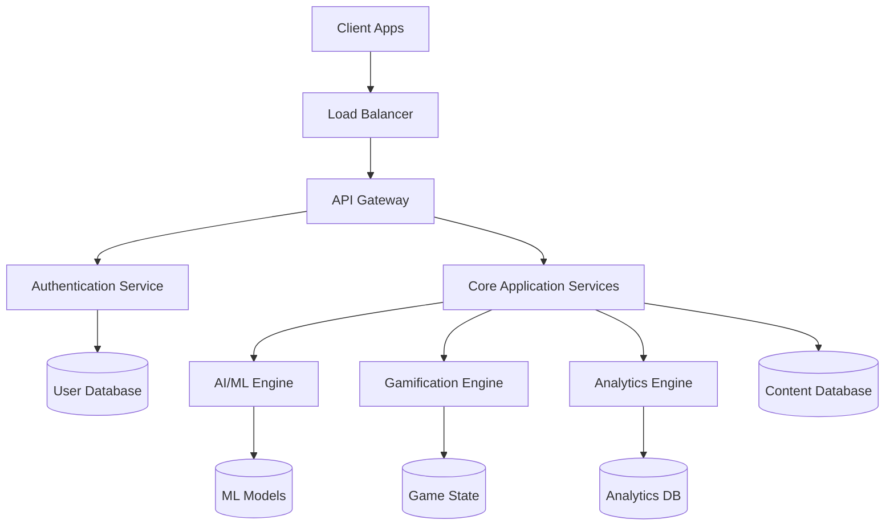
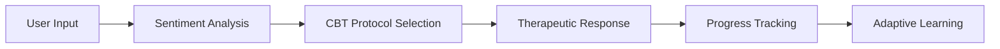
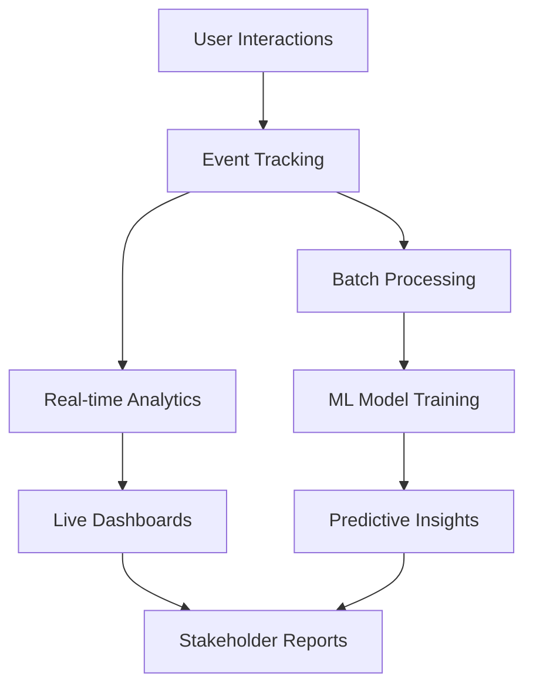

# 🌟 FINMEN — Next-Gen Digital Wellness & Financial Literacy Platform

<div align="center">


[](https://choosealicense.com/licenses/mit/)
[](https://reactjs.org/)
[](https://nodejs.org/)
[](https://www.mongodb.com/)
[](https://openai.com/)

**Empowering India's Youth Through AI-Driven Mental Wellness & Financial Education**

[🚀 Live Demo](#-live-demo) • [📖 Documentation](#-documentation) • [🤝 Contributing](#-contributing) • [💬 Community](#-community)

</div>

---

## 🎯 Overview

**FINMEN** is a revolutionary digital platform designed specifically for India's youth ecosystem, addressing the critical gap in mental wellness and financial literacy education. Combining cutting-edge AI technology with culturally-sensitive design, FINMEN serves students aged **8-25** through an immersive, gamified learning experience.

### 🌍 Mission Statement
*"To create a generation of emotionally resilient and financially literate individuals who can navigate life's challenges with confidence and wisdom."*

---

## ✨ Key Differentiators

<table>
<tr>
<td width="50%">

### 🇮🇳 **India-Centric Design**
- Regional language support (Hindi, English)
- Cultural context awareness
- Local financial instruments integration
- Indian education system alignment

</td>
<td width="50%">

### 🤖 **AI-Powered Intelligence**
- Advanced CBT therapeutic algorithms
- Personalized learning pathways
- Predictive wellness analytics
- Smart recommendation engine

</td>
</tr>
<tr>
<td width="50%">

### 🎮 **Gamification Excellence**
- Multi-tier progression system
- Social learning features
- Achievement-based rewards
- Peer competition elements

</td>
<td width="50%">

### 🔒 **Privacy-First Approach**
- Zero-knowledge architecture
- GDPR & Indian data laws compliant
- End-to-end encryption
- Transparent data usage

</td>
</tr>
</table>

---

## 🏗️ Advanced Architecture

### 🔧 Technology Stack

<div align="center">

| Layer | Technologies | Purpose |
|-------|-------------|---------|
| **Frontend** |    | Ultra-fast, responsive UI |
| **Backend** |    | Scalable server architecture |
| **Database** |   | High-performance data layer |
| **AI/ML** |   | Intelligent user interactions |
| **DevOps** |    | Automated deployment pipeline |

</div>

### 🏛️ System Architecture



---

## 🚀 Core Feature Matrix

### 🧠 **Intelligent Mood Analytics**

<details>
<summary><strong>🎭 Advanced Mood Tracking System</strong></summary>

- **Multi-Modal Input**: Emoji, text, voice, and behavioral pattern analysis
- **Predictive Analytics**: AI-powered mood forecasting and intervention alerts
- **Cultural Sensitivity**: Indian emotional expression patterns recognition
- **Privacy-First**: On-device processing with optional cloud sync
- **Integration**: Seamless connection with CBT and wellness modules

**Technical Implementation:**
```javascript
// Mood Analysis Engine
const moodAnalysis = {
  inputs: ['emoji', 'journal', 'activity', 'biometric'],
  processing: 'edge-ai-model',
  privacy: 'differential-privacy',
  insights: 'personalized-recommendations'
};
```

</details>

### 🤖 **Cognitive Behavioral Therapy (CBT) Engine**

<details>
<summary><strong>🧘‍♀️ AI-Powered Therapeutic Conversations</strong></summary>

- **Adaptive Protocols**: Dynamic CBT session flows based on user responses
- **Cultural Integration**: Indian mindfulness and wellness practices
- **Crisis Detection**: Real-time risk assessment and emergency protocols
- **Progress Tracking**: Quantified mental wellness metrics
- **Professional Integration**: Seamless referral to licensed therapists

**CBT Flow Architecture:**


</details>

### 💰 **Financial Literacy Ecosystem**

<details>
<summary><strong>🎯 Gamified Financial Education</strong></summary>

#### **Learning Modules:**
- **🏫 Junior Track (Ages 8-15)**: Basic money concepts, saving habits, family finances
- **🎓 Pro Track (Ages 16-25)**: Investment strategies, career planning, entrepreneurship
- **🏆 Master Track (25+)**: Advanced financial planning, tax optimization, wealth building

#### **Interactive Simulations:**
- Virtual stock market trading
- Budget planning challenges
- Entrepreneurship simulations
- Real estate investment games
- Cryptocurrency education modules

#### **Indian Financial Instruments:**
- SIP calculators and planners
- PPF and EPF optimization
- Tax-saving investment guides
- Digital payment literacy
- Government scheme awareness

</details>

### 🏆 **Advanced Gamification System**

<details>
<summary><strong>🎮 Multi-Layered Engagement Framework</strong></summary>

#### **HealCoin Economy:**
```
🪙 Earning Mechanisms:
├── Daily wellness check-ins (+10 coins)
├── CBT session completion (+25 coins)
├── Financial quiz mastery (+15 coins)
├── Community contributions (+20 coins)
├── Streak maintenance (bonus multipliers)
└── Peer mentoring (+30 coins)

💎 Redemption Options:
├── Educational course vouchers
├── Mental health app subscriptions
├── Charitable donations
├── Exclusive platform features
└── Real-world financial instruments
```

#### **Achievement System:**
- **🥉 Bronze**: Foundation level accomplishments
- **🥈 Silver**: Consistent engagement rewards  
- **🥇 Gold**: Excellence in specific domains
- **💎 Platinum**: Community leadership recognition
- **🏆 Diamond**: Platform mastery achievements

</details>

---

## 📊 Advanced Dashboard Ecosystem

### 👨‍🎓 **Student Dashboard**
- **Wellness Metrics**: Mood trends, CBT progress, stress indicators
- **Financial Profile**: Learning progress, investment simulations, goal tracking
- **Social Features**: Peer rankings, study groups, mentorship connections
- **Personalization**: AI-driven content recommendations and learning paths

### 👨‍🏫 **Educator Portal**
- **Class Analytics**: Aggregated wellness and learning insights
- **Curriculum Integration**: Lesson plan suggestions and resource library
- **Student Support**: Early intervention alerts and progress monitoring
- **Reporting Tools**: Comprehensive academic and wellness reports

### 👨‍💼 **Administrator Console**
- **Platform Analytics**: User engagement, feature utilization, system health
- **Content Management**: Dynamic content creation and moderation tools
- **User Management**: Advanced user lifecycle and support features
- **Integration Hub**: Third-party service connections and API management

---

## 🛠️ Development Ecosystem

### 📋 **Prerequisites**

```bash
# System Requirements
Node.js >= 18.0.0
MongoDB >= 5.0
Redis >= 6.0
Docker >= 20.10 (optional)
```

### 🚀 **Quick Start Guide**

<details>
<summary><strong>🐳 Docker Development Setup (Recommended)</strong></summary>

```bash
# Clone the repository
git clone https://github.com/finmen-platform/finmen.git
cd finmen

# Start the complete development environment
docker-compose up -d

# Access the application
# Frontend: http://localhost:3000
# Backend API: http://localhost:5000
# MongoDB: localhost:27017
# Redis: localhost:6379
```

</details>

<details>
<summary><strong>⚡ Manual Development Setup</strong></summary>

#### **Backend Configuration**
```bash
cd finmen-server
npm install

# Configure environment variables
cp .env.example .env
# Edit .env with your configuration

# Database setup
npm run db:migrate
npm run db:seed

# Start development server
npm run dev
```

#### **Frontend Configuration**
```bash
cd finmen-client
npm install

# Configure environment variables
cp .env.example .env
# Edit .env with your configuration

# Start development server
npm run dev
```

</details>

### 🔐 **Environment Configuration**

<details>
<summary><strong>📝 Backend Environment Variables</strong></summary>

```env
# Server Configuration
NODE_ENV=development
PORT=5000
API_VERSION=v1

# Database Configuration
MONGO_URI=mongodb://localhost:27017/finmen
REDIS_URL=redis://localhost:6379

# Authentication
JWT_SECRET=your_ultra_secure_jwt_secret
JWT_EXPIRE=30d
REFRESH_TOKEN_SECRET=your_refresh_token_secret

# OAuth Configuration
GOOGLE_CLIENT_ID=your_google_client_id
GOOGLE_CLIENT_SECRET=your_google_client_secret
GOOGLE_CALLBACK_URL=http://localhost:5000/api/auth/google/callback

# AI Services
OPENAI_API_KEY=your_openai_api_key
OPENAI_MODEL=gpt-4

# Email Services
SMTP_HOST=smtp.gmail.com
SMTP_PORT=587
SMTP_USER=your_email@gmail.com
SMTP_PASS=your_app_password

# File Storage
AWS_ACCESS_KEY_ID=your_aws_access_key
AWS_SECRET_ACCESS_KEY=your_aws_secret_key
AWS_BUCKET_NAME=finmen-storage

# Analytics
GOOGLE_ANALYTICS_ID=your_ga_id
MIXPANEL_TOKEN=your_mixpanel_token

# Security
RATE_LIMIT_WINDOW=15
RATE_LIMIT_MAX_REQUESTS=100
CORS_ORIGIN=http://localhost:3000
```

</details>

<details>
<summary><strong>🎨 Frontend Environment Variables</strong></summary>

```env
# API Configuration
VITE_API_BASE_URL=http://localhost:5000/api
VITE_API_VERSION=v1

# Authentication
VITE_GOOGLE_CLIENT_ID=your_google_client_id

# Features Flags
VITE_ENABLE_CBT_CHATBOT=true
VITE_ENABLE_VOICE_NOTES=true
VITE_ENABLE_DARK_MODE=true

# Analytics
VITE_GOOGLE_ANALYTICS_ID=your_ga_id
VITE_HOTJAR_ID=your_hotjar_id

# External Services
VITE_RAZORPAY_KEY=your_razorpay_key
VITE_GOOGLE_MAPS_API_KEY=your_maps_key
```

</details>

---

## 📁 Advanced Project Structure

<details>
<summary><strong>🗂️ Detailed Directory Architecture</strong></summary>

```
finmen-frontend/
├── 📁 finmen-client/                 # Frontend React Application
│   ├── 📁 src/
│   │   ├── 📁 components/           # Reusable UI components
│   │   │   ├── 📁 common/          # Shared components
│   │   │   ├── 📁 forms/           # Form components
│   │   │   ├── 📁 charts/          # Data visualization
│   │   │   └── 📁 layout/          # Layout components
│   │   ├── 📁 pages/               # Route-based page components
│   │   │   ├── 📁 auth/            # Authentication pages
│   │   │   ├── 📁 dashboard/       # Dashboard pages
│   │   │   ├── 📁 wellness/        # Wellness module pages
│   │   │   └── 📁 finance/         # Finance module pages
│   │   ├── 📁 hooks/               # Custom React hooks
│   │   ├── 📁 context/             # React context providers
│   │   ├── 📁 services/            # API service layers
│   │   ├── 📁 utils/               # Utility functions
│   │   ├── 📁 styles/              # Global styles and themes
│   │   └── 📁 assets/              # Static assets
│   ├── 📁 public/                   # Public static files
│   └── 📄 package.json
│
├── 📁 finmen-backend/                # Backend Node.js API
│   ├── 📁 src/
│   │   ├── 📁 controllers/         # Route controllers
│   │   │   ├── 📄 authController.js
│   │   │   ├── 📄 userController.js
│   │   │   ├── 📄 moodController.js
│   │   │   ├── 📄 cbtController.js
│   │   │   └── 📄 gameController.js
│   │   ├── 📁 models/              # Database models
│   │   │   ├── 📄 User.js
│   │   │   ├── 📄 MoodEntry.js
│   │   │   ├── 📄 CBTSession.js
│   │   │   └── 📄 GameProgress.js
│   │   ├── 📁 routes/              # API route definitions
│   │   ├── 📁 middleware/          # Express middleware
│   │   ├── 📁 services/            # Business logic services
│   │   │   ├── 📄 aiService.js
│   │   │   ├── 📄 emailService.js
│   │   │   └── 📄 analyticsService.js
│   │   ├── 📁 utils/               # Utility functions
│   │   ├── 📁 config/              # Configuration files
│   │   └── 📁 validators/          # Input validation schemas
│   ├── 📁 tests/                   # Test suites
│   └── 📄 package.json
│
├── 📁 finmen-ai/                   # AI/ML Microservice
│   ├── 📁 models/                  # ML model files
│   ├── 📁 training/                # Training scripts
│   └── 📁 inference/               # Inference endpoints
│
├── 📁 docs/                        # Documentation
│   ├── 📄 API.md                   # API documentation
│   ├── 📄 DEPLOYMENT.md            # Deployment guide
│   └── 📄 CONTRIBUTING.md          # Contribution guidelines
│
├── 📁 scripts/                     # Automation scripts
├── 📁 docker/                      # Docker configurations
├── 📄 docker-compose.yml           # Development environment
├── 📄 package.json                 # Root package configuration
└── 📄 README.md                    # This file
```

</details>

---

## 🔒 Security & Compliance

### 🛡️ **Security Measures**

<div align="center">

| Security Layer | Implementation | Standards |
|----------------|----------------|-----------|
| **Authentication** | JWT + OAuth 2.0 + MFA | OWASP Compliance |
| **Data Encryption** | AES-256 at rest, TLS 1.3 in transit | Industry Standard |
| **API Security** | Rate limiting, CORS, Input validation | OWASP Top 10 |
| **Privacy** | Differential privacy, Data anonymization | GDPR & IT Act 2000 |
| **Infrastructure** | WAF, DDoS protection, Security monitoring | SOC 2 Type II |

</div>

### 📋 **Compliance Framework**

- **🇮🇳 Indian Data Protection Laws**: Complete compliance with IT Act 2000 and upcoming DPDP Act
- **🌍 GDPR Compliance**: European data protection standards implementation
- **🏥 Healthcare Standards**: HIPAA-level privacy for mental health data
- **🎓 Educational Compliance**: FERPA compliance for student data protection
- **🔒 Security Certifications**: SOC 2, ISO 27001 preparation

---

## 📈 Analytics & Monitoring

### 📊 **Advanced Analytics Stack**



### 🎯 **Key Performance Indicators (KPIs)**

<details>
<summary><strong>📋 Wellness Metrics</strong></summary>

- **Engagement Metrics**: DAU, MAU, Session duration, Feature adoption
- **Wellness Outcomes**: Mood improvement trends, CBT completion rates
- **Learning Progress**: Financial literacy assessment scores, Module completion
- **Social Impact**: Peer interactions, Community contributions, Mentorship activities

</details>

<details>
<summary><strong>📋 Business Metrics</strong></summary>

- **User Growth**: Registration rates, Conversion funnels, Retention cohorts
- **Platform Health**: System uptime, API response times, Error rates
- **Content Performance**: Most engaging modules, User pathway analysis
- **ROI Measurement**: Cost per acquisition, Lifetime value, Feature ROI

</details>

---

## 🚀 Deployment & DevOps

### ☁️ **Cloud Infrastructure**

<div align="center">

| Service | AWS | Azure | GCP |
|---------|-----|-------|-----|
| **Compute** | EC2, ECS, Lambda | App Service, Functions | Compute Engine, Cloud Run |
| **Database** | RDS, DocumentDB | CosmosDB, PostgreSQL | Cloud SQL, Firestore |
| **Storage** | S3, EFS | Blob Storage | Cloud Storage |
| **CDN** | CloudFront | Azure CDN | Cloud CDN |
| **Monitoring** | CloudWatch | Monitor | Operations Suite |

</div>

### 🔄 **CI/CD Pipeline**

```yaml
# GitHub Actions Workflow Example
name: FINMEN CI/CD Pipeline

on:
  push:
    branches: [main, develop]
  pull_request:
    branches: [main]

jobs:
  test:
    runs-on: ubuntu-latest
    steps:
      - uses: actions/checkout@v3
      - name: Setup Node.js
        uses: actions/setup-node@v3
        with:
          node-version: '18'
      - name: Install dependencies
        run: npm ci
      - name: Run tests
        run: npm test
      - name: Run security audit
        run: npm audit

  deploy:
    needs: test
    runs-on: ubuntu-latest
    if: github.ref == 'refs/heads/main'
    steps:
      - name: Deploy to production
        run: |
          echo "Deploying to production..."
          # Deployment scripts here
```

---

## 🤝 Contributing

### 👥 **Our Development Team**

<div align="center">

<table>
<tr>
<td align="center">
<br />
<sub><b>Vikash Kumar</b></sub><br />
<sub>Backend Architect</sub>
</td>
<td align="center">
<br />
<sub><b>Tilak Devi</b></sub><br />
<sub>Backend Developer</sub>
</td>
<td align="center">
<br />
<sub><b>Yatharth Mishra</b></sub><br />
<sub>Frontend Lead</sub>
</td>
</tr>
<tr>
<td align="center">
<br />
<sub><b>Suhani Verma</b></sub><br />
<sub>AI/ML Engineer</sub>
</td>
<td align="center">
<br />
<sub><b>Vaishnavi Hengane</b></sub><br />
<sub>AI/ML Engineer</sub>
</td>
<td align="center">
<br />
<sub><b>Shobhit Dwivedi</b></sub><br />
<sub>Frontend Developer</sub>
</td>
</tr>
</table>

</div>

### 🛠️ **Contribution Guidelines**

<details>
<summary><strong>🔄 Development Workflow</strong></summary>

1. **🍴 Fork & Clone**
   ```bash
   git clone https://github.com/your-username/finmen.git
   cd finmen
   ```

2. **🌿 Create Feature Branch**
   ```bash
   git checkout -b feature/amazing-new-feature
   ```

3. **💻 Development Standards**
   - Follow ESLint and Prettier configurations
   - Write comprehensive tests (minimum 80% coverage)
   - Update documentation for new features
   - Follow conventional commit messages

4. **🧪 Testing Requirements**
   ```bash
   npm run test           # Unit tests
   npm run test:e2e       # End-to-end tests
   npm run test:coverage  # Coverage reports
   ```

5. **📝 Pull Request Process**
   - Ensure all tests pass
   - Update CHANGELOG.md
   - Request review from 2+ team members
   - Address all feedback promptly

</details>

### 🏷️ **Code Standards**

- **JavaScript/TypeScript**: ESLint + Prettier
- **React**: Functional components + Hooks
- **CSS**: Tailwind CSS + CSS Modules
- **Testing**: Jest + React Testing Library
- **Documentation**: JSDoc + Markdown

---

## 📄 License & Legal

### 📜 **Open Source License**

```
MIT License

Copyright (c) 2024 FINMEN Platform Team

Permission is hereby granted, free of charge, to any person obtaining a copy
of this software and associated documentation files (the "Software"), to deal
in the Software without restriction, including without limitation the rights
to use, copy, modify, merge, publish, distribute, sublicense, and/or sell
copies of the Software, and to permit persons to whom the Software is
furnished to do so, subject to the following conditions:

The above copyright notice and this permission notice shall be included in all
copies or substantial portions of the Software.

THE SOFTWARE IS PROVIDED "AS IS", WITHOUT WARRANTY OF ANY KIND, EXPRESS OR
IMPLIED, INCLUDING BUT NOT LIMITED TO THE WARRANTIES OF MERCHANTABILITY,
FITNESS FOR A PARTICULAR PURPOSE AND NONINFRINGEMENT.
```

---

## 📞 Support & Community

### 💬 **Get Help**

<div align="center">

[](https://discord.gg/finmen)
[](https://finmen.slack.com)
[](https://github.com/finmen-platform/finmen/discussions)

**📧 Email**: support@finmen.in | **🌐 Website**: https://finmen.in

</div>

### 🗺️ **Roadmap**

<details>
<summary><strong>🎯 2024 Q3-Q4 Goals</strong></summary>

- [ ] **🚀 Beta Launch**: Limited user beta with 1000+ students
- [ ] **🤖 Advanced AI**: GPT-4 integration for enhanced CBT sessions
- [ ] **📱 Mobile Apps**: Native iOS and Android applications
- [ ] **🌐 Multi-language**: Hindi, Tamil, Bengali language support
- [ ] **🏫 School Partnerships**: Integration with 50+ educational institutions

</details>

<details>
<summary><strong>🔮 2025 Vision</strong></summary>

- [ ] **🌟 1M+ Users**: Scale to serve one million active users
- [ ] **🏆 Advanced Gamification**: VR/AR integration for immersive learning
- [ ] **🤝 Professional Network**: Licensed therapist and financial advisor integration
- [ ] **📊 Research Platform**: Academic research collaboration features
- [ ] **🌍 Global Expansion**: Adaptation for other developing markets

</details>

---

<div align="center">

### 🌟 **Star us on GitHub** if you find FINMEN helpful!

[](https://github.com/finmen-platform/finmen/stargazers)
[](https://github.com/finmen-platform/finmen/network/members)
[](https://github.com/finmen-platform/finmen/watchers)

**Made with ❤️ for India's Digital Future**

*Building bridges between mental wellness and financial prosperity, one student at a time.*

</div>
